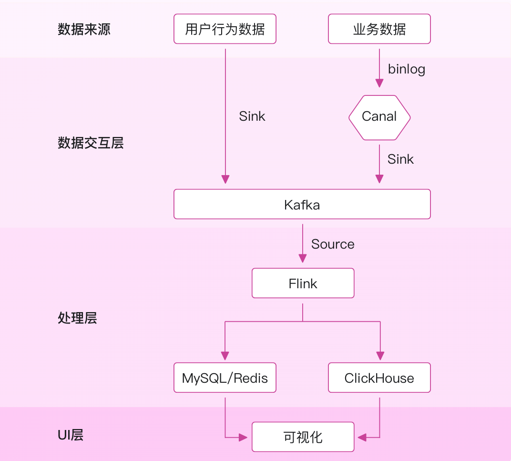

# flink-clickhouse-etl

real-time Flink process data into ClickHouse

## Function

- [x] Flink从Kafka解析数据
- [x] 从高德地图API解析IP，获得省份城市信息
- [x] 布隆过滤器实现新用户筛选
- [x] 用户多维度TopN统计分析
- [x] Flink ETL 
- [ ] Flink CEP
- [ ] Flink SQL

## Flink从Kafka解析数据

- 多版本迭代解析数据，通过数据解析的封装，实现对数据格式的优化解析。
- 在kafka connector 中泛型的使用，实现良好的解析扩展性。
- 解析数据时，通过每一条数据的topic，partition，offset 来设计主键。
- 消费数据的offset可以存储到状态后端，保证数据消费成功后才提交offset。

## Flink ETL

### 用户统计

1. 按照操作系统进行新老用户统计，使用到分区等知识。
2. 按照新老用户进行统计分析。
3. 按照device 进行进行判断是否是新老用户。采用bloom Filter方法实现，也可以直接使用state进行统计。

### TopN统计

基于时间窗口的不同event类型，类别，商品TopN的访问量。使用滑动窗口进行5min数据粒度划分，滑动时间为1分钟。使用listState进行聚合统计，在聚合统计中使用定时器，在窗口结束时间 + 1 进行全量TopN 排序。同时使用值状态和map状态都可以统计。

## 数据Sink 到ClickHouse 

通过使用JDBC连接到CH，需要导入flink-connector-jdbc，实现JDBCSink。
在CH设计表的时候，使用ReplacingMergeTree，通过每条数据的唯一主键，结合FLink exactly once预计，保证整个数据链路的exactly once语义。

